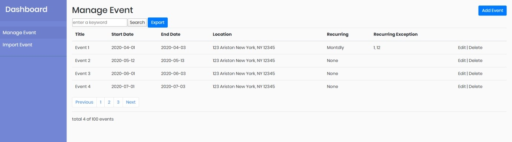
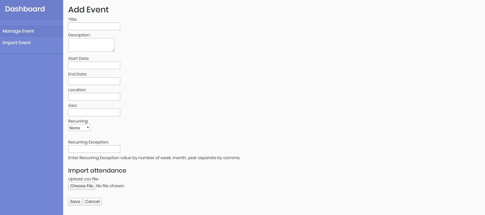
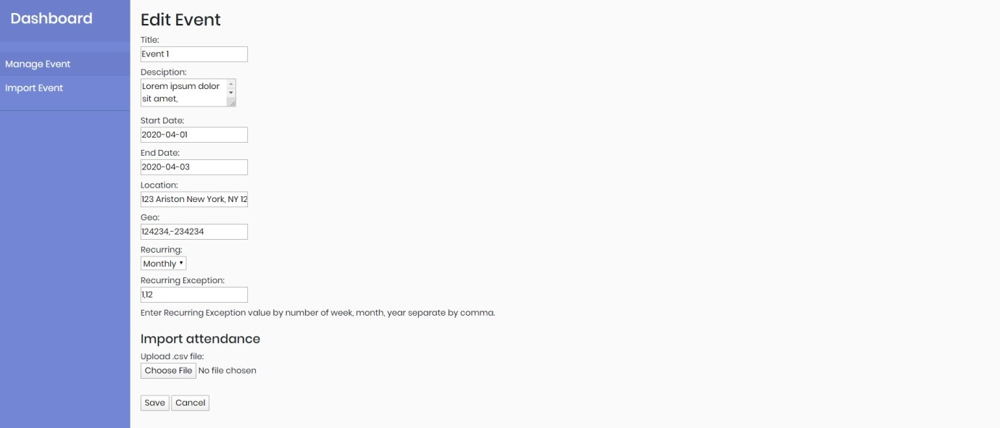

# Recurring Events Plan

## Database structure

* Table ‘event’: 
This table contains event's information, e.g title, description, start date, end date,time-zone, location, geo, owner (Sent-by), status : public, private, confidential.

* Table ‘recurring_event’:
This table contains recurring options : every week, every month, every year. And exceptions by week, every month, year.

* Table ‘event_members’:
This table contains the members/attendance.

## Development 
Including step by step for implementing application.
1. Create Database Structure
All table need to have id and index for search quickly.

2. UI Designs & implementing

## Manage event page

1.	The user must be able to search any event data and export any event.
2.	The user must be able to sort by column.
3.	When clicking on  ‘Add Event’  then redirect to ‘Add Event page’ 
4.	When clicking on  ‘a title’ then redirect to ‘Event detail page’ 
5.	When clicking on  ‘Edit’  then redirect to ‘Edit Event page’ 
6.	When clicking on  ‘Delete’  then redirect to ‘Delete Event confirmation page’ . In ‘Delete Event confirmation page’ if the user click ‘Yes’ then delete selected event then redirect back this page. if the user click ‘Cancel’ then redirect back this page.

## Add/Update/Delete event

## Export event

-	Ability to export event to ICS standard or CSV format.

-	When export CSV format should be able to select ‘attendance’’ belong with the event.

## Import members/attendance to the event

-	Title is required.
-	Description is with full HTML, media format. Should have HTML editor for this field.

-	Start Date is required.

-	End Date is optional.

-	Location is event location and required. Ability to auto-generate GEO from location

-	Recurring is a select box with options: None, Weekly, Monthly, Yearly. Default is None.

-	Recurring Exception is a textbox and optional.

-	If the user has to upload a .csv file for ‘Import attendance’ then all row will be inserted into table ‘event_members’ for current event.

## Import event including recurring options

-	Input file must have .ics extension. 

-	Ability to import with multiple events in a file.
